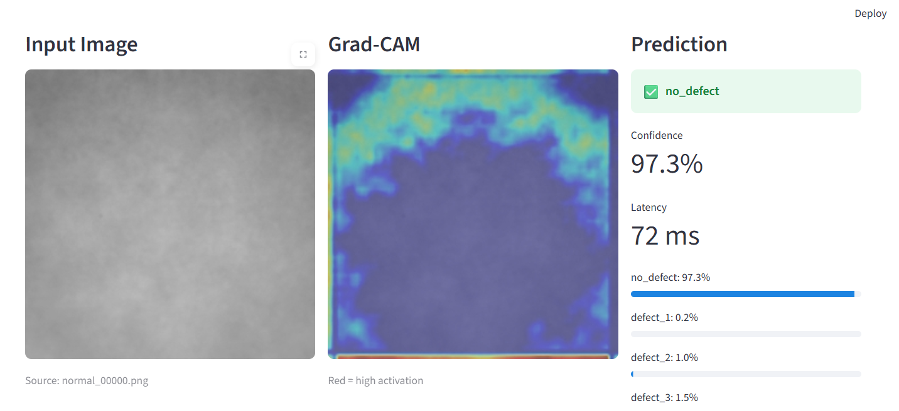
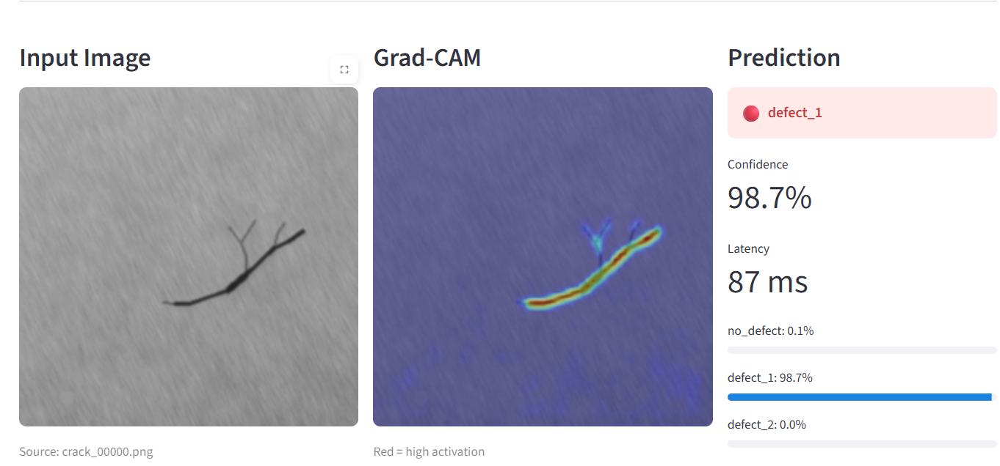
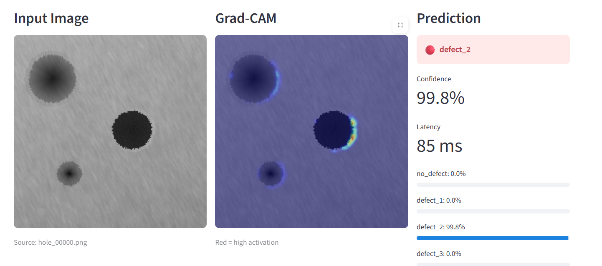
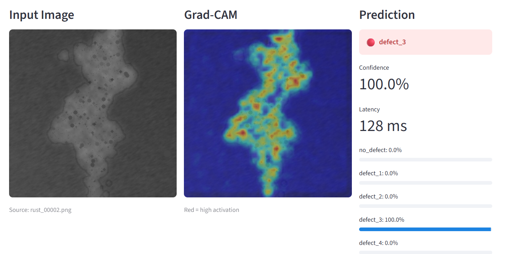
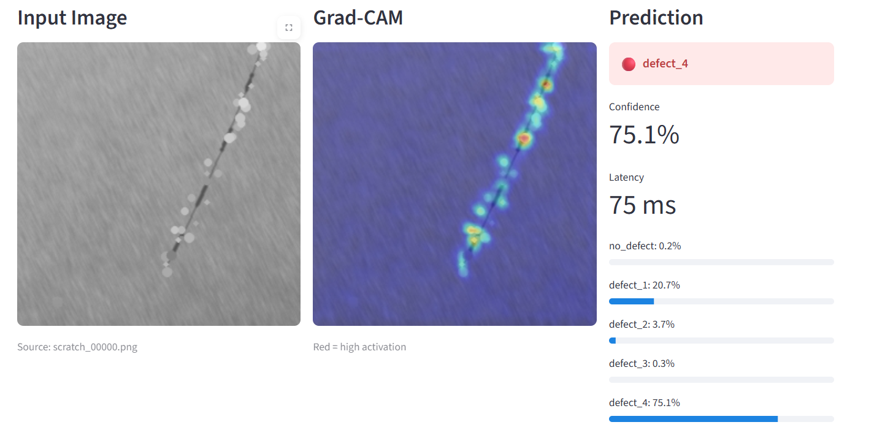

# Inference

## Overview

The inference stage uses the trained CNN model to predict the class of a new steel surface image. Before making a prediction, the image is preprocessed using the same steps as the validation images. The model then returns the predicted class and its confidence score.

---

# INFER-1: Load Trained Model

## Purpose

This function loads the saved CNN model and prepares it for making predictions.

## What It Does

- Loads the saved model checkpoint.
- Restores the trained model weights.
- Sets the model to evaluation mode.

## Why Is It Important?

The trained model must be loaded before it can classify new images.

## INFER-1 Code

def load_model(self) -> None:
        
        if not self.checkpoint_path.exists():
            raise FileNotFoundError(
                f"Checkpoint not found: {self.checkpoint_path}"
        )

        checkpoint = torch.load(
            self.checkpoint_path,
            map_location=self.device
        )

        model = SteelCNN(num_classes=NUM_CLASSES)

        model.load_state_dict(checkpoint["model_state_dict"])

        model.to(self.device)

        model.eval()

        self.model = model

        elapsed_ms = (time.perf_counter() - start) * 1000
        logger.info("Model loaded | time=%.0fms", elapsed_ms)

# INFER-2: Predict Image Class

## Purpose

This function predicts the class of a new steel surface image.

## What It Does

- Loads the input image.
- Applies preprocessing transforms.
- Passes the image through the trained CNN.
- Calculates prediction probabilities.
- Returns the predicted class and confidence score.

## Why Is It Important?

This function allows the trained model to classify new unseen images.

## INFER-2 Code

  def predict(self, image: np.ndarray) -> dict:
        
        result = self.transform(image=image)
        tensor = result["image"]

        tensor = tensor.unsqueeze(0)

        tensor = tensor.to(self.device)

        with torch.no_grad():
            logits = self.model(tensor)

        probs = F.softmax(logits, dim=1)

        confidence, predicted = probs.max(dim=1)

        predicted_idx = predicted.item()

        confidence_val = confidence.item()

        label = CLASS_NAMES[predicted_idx]

        probs_np = probs.squeeze().cpu().numpy()

        class_scores = {
            name: float(p)
            for name, p in zip(CLASS_NAMES, probs_np)
        }

        elapsed_ms = (time.perf_counter() - start) * 1000
        self._inference_count += 1

        logger.info(
            "Inference #%d | label=%s | confidence=%.3f | time=%.1fms",
            self._inference_count, label, confidence_val, elapsed_ms,
        )

        return {
            "label": label,
            "confidence": confidence_val,
            "class_scores": class_scores,
            "predicted_idx": predicted_idx,
            "latency_ms": elapsed_ms,
        }

# Summary

The inference stage loads the trained CNN model and uses it to classify new steel surface images. The output includes the predicted class and the confidence of the prediction.

# Results

## Overview

After training, the CNN model was able to classify steel surface images into five categories. The trained model can successfully make predictions on new images using the inference pipeline.

# Model Performance

The model learned meaningful features from the training images and was evaluated using the validation dataset during training.

The best-performing model was automatically saved and later used for inference.

# Sample Predictions

The trained model was tested on multiple steel surface images using the Streamlit application. The model produced predictions with confidence scores for different defect categories.

## Prediction Examples

### NO DEFECT

### DEFECT-1

### DEFECT-2 

### DEFECT-3

### DEFECT-4

